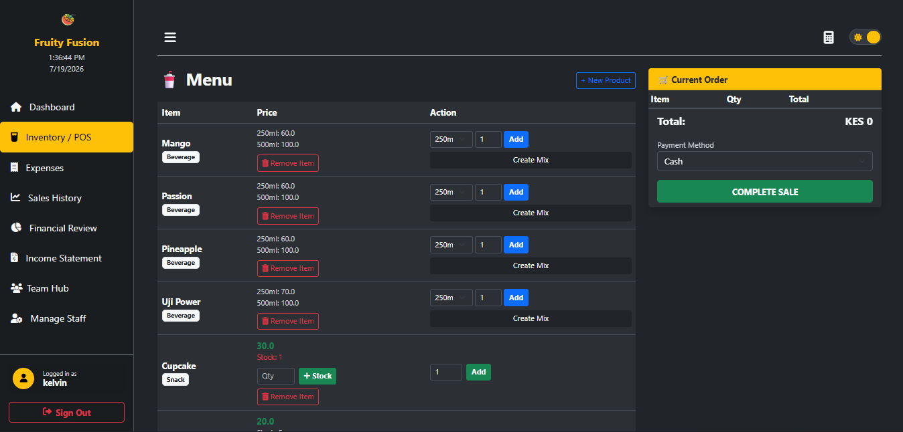
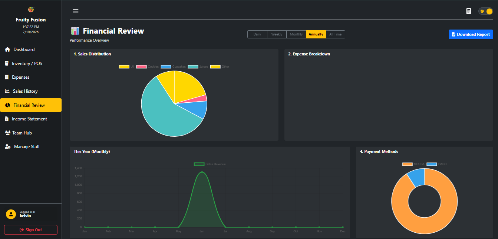
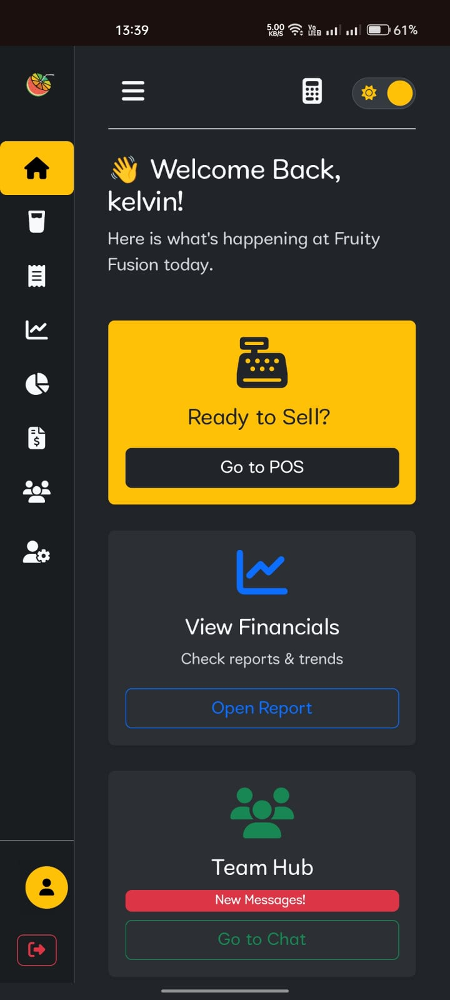

# Fruity Fusion Management System

## Overview
Fruity Fusion is a custom-built, full-stack Point of Sale (POS) and business analytics dashboard developed to streamline the daily operations of a local beverage and snack business in Kenya. 

Bridging the gap between software engineering and applied mathematics, this system was designed to replace manual ledger tracking with a secure, automated digital ecosystem. It handles everything from processing Mpesa and cash transactions to generating deep financial insights and managing complex inventory constraints.

## The Problem & The Solution
**The Challenge:** Managing a hybrid menu of distinct, countable snacks (like cupcakes) alongside custom-blended beverages (like Ukwaju juice, pineapple mint, and Uji Power) creates severe inventory tracking challenges. Furthermore, manually calculating daily revenue across multiple payment channels and staff shifts left room for accounting errors.

**The Solution:** A unified dashboard that implements role-based security to separate administrative financial controls from staff-level POS access. The app automatically standardizes mobile responsiveness for fast-paced, on-the-go service, while generating exportable, data-driven financial reports to optimize business margins.

---

## Key Features

*   **Role-Based Access Control (RBAC):** Secured with Spring Security, ensuring that sensitive actions (like voiding sales, managing staff accounts, or viewing full financial reviews) are strictly locked to the owner/admin, while providing a frictionless POS view for floor staff.
*   **Adaptive Responsive UI:** Features a mobile-optimized, thumb-friendly interface with an auto-collapsing, icon-only sidebar for seamless operation on smaller screens at the register.
*   **Intelligent Inventory Routing:** Custom backend logic that differentiates between bulk raw-ingredient beverages and countable snack items, allowing for precise unit-based stock additions directly from the POS.
*   **Real-Time Analytics Dashboard:** Integrates Chart.js to visualize daily, weekly, and monthly sales trends, expense breakdowns, and Mpesa vs. Cash transaction ratios.
*   **Automated Financial Reporting:** One-click generation of professional business reports exportable to PDF, Excel, and Word (via HTML-docx-js).
*   **Internal Team Hub:** A built-in communication ledger for staff to log notices and direct message management without leaving the application ecosystem.

---

## Technology Stack

### **Backend**
*   **Java 21+**
*   **Spring Boot** (Web, Data JPA)
*   **Spring Security** (Authentication, Authorization)
*   **MySQL** (Relational Database)
*   **Hibernate** (ORM)

### **Frontend**
*   **HTML5 / CSS3 / JavaScript**
*   **Thymeleaf** (Server-side Java template engine)
*   **Bootstrap 5** (Responsive layout and component styling)
*   **Chart.js** (Data visualization)
*   **HTML-docx-js / SheetJS** (Document generation)

---

## Application Gallery

| Point of Sale (POS) | Financial Analytics | Mobile View |
| :---: | :---: | :---: |
|  |  |  |

## Project Status
Note: This is a proprietary management system developed for a private client. The source code is provided here for portfolio and demonstration purposes only, and local installation instructions have been intentionally omitted to protect the business's custom configurations.
